# Báo cáo Lab Day 1 — Sinh viên AICB — MSSV: 02594

---

## 1. Thiết lập

- **Môi trường:** Kaggle Notebook, GPU Tesla T4 (16GB VRAM), PyTorch 2.x, Python 3.10+, CUDA 12.x.
- **Dữ liệu:** Forest CoverType (Blackard & Dean, UCI); tập `train` 464 809 mẫu / `eval` 116 203 mẫu theo metadata chuẩn `split_metadata.csv`. Validation tách 20% từ train (phân tầng stratified theo nhãn, `random_state=42`) $\rightarrow$ **371 847 mẫu train** / **92 962 mẫu val**.
- **Chuẩn hoá:** Chỉ chuẩn hoá 10 đặc trưng số liên tục (cột 0..9) bằng $\mu$ và $\sigma$ tính độc quyền trên 371 847 mẫu train; 44 cột nhị phân one-hot giữ nguyên. Không rò rỉ dữ liệu (data leakage) sang val hay eval.
- **Model:** `M-base` (MLP: `54 → 256 → 128 → 7`, đúng **47 879 tham số**). ReLU ở mọi lớp ẩn, bias = True, không BatchNorm, không residual, đầu ra logits thô `(B, 7)`.
- **Baseline:** Mất mát Cross-Entropy, bộ tối ưu SGD + Momentum 0.9, tốc độ học $\eta = 0.1$, batch size 512, 20 epochs, khởi tạo He (Kaiming Normal).
- **Mốc tham chiếu tối thiểu:** Chiến lược "luôn đoán lớp đa số" (lớp 1) trên val đạt Accuracy = **0.4876**, nhưng Macro-F1 chỉ $\approx$ **0.0936**.
- **Các chủ đề đã thử nghiệm (đủ cả 7/7 nhóm):**
  - [x] Hàm mất mát (Loss: CE vs MSE)
  - [x] Bộ tối ưu hoá (Optimizer: SGD, SGD+Momentum, Adam, AdamW)
  - [x] Hyper-parameter (Batch size, độ rộng M-wide, độ sâu M-deep)
  - [x] Dropout ($q \in \{0.1, 0.3, 0.5\}$)
  - [x] Gradient clipping (chuẩn L2 toàn cục ở lr thường và lr cao)
  - [x] Mixed precision (FP16 qua GradScaler & Autocast)
  - [x] Khởi tạo tham số (Zeros, Normal, Xavier, He)

---

## 2. Kiểm tra ban đầu và độ nhiễu

| Kiểm tra | Kết quả thực đo | Nhận xét đối chiếu |
|---|---|---|
| Số tham số / shape logits | **47 879** / `(B, 7)` | Khớp 100% `EXPECTED_PARAMS[(256, 128)]` |
| Loss bước 0 trên Val (so với $\ln 7 \approx 1.9459$) | **1.9782** (seed 2) / **1.9005** (seed 3) | Rất sát lý thuyết $\ln 7$, chứng minh phân bố logit ban đầu đồng đều quanh 0 |
| Quá khớp 20 mẫu (250 bước Adam) | Loss: **0.000008**, Acc: **100%** | Mạng có đủ năng lực ghi nhớ mẫu; vòng lặp gradient và autograd hoạt động hoàn hảo |
| Mọi tham số có gradient $\neq$ 0 | **ĐẠT** | Tất cả `W1, b1, W2, b2, W3, b3` đều có gradient norm $> 0$ sau `backward()` |
| Số seed baseline đã chạy | **3 seeds** (`base-s1`, `base-s2`, `base-s3`) | Chạy cùng siêu tham số trên 3 hạt ngẫu nhiên khác nhau |
| Baseline: Val Accuracy (TB $\pm$ $\sigma$) | **0.9078 $\pm$ 0.0031** | Các lần chạy: 0.9035, 0.9109, 0.9090 |
| Baseline: Val Macro-F1 (TB $\pm$ $\sigma$) | **0.8531 $\pm$ 0.0092** | Các lần chạy: 0.8434, 0.8654, 0.8505 |

**Ngưỡng nhiễu dùng trong báo cáo:** $2\sigma = \mathbf{0.0183}$ ($\approx 0.018$ theo Val Macro-F1). Bất kỳ cải thiện hoặc suy giảm nào có độ chênh lệch nhỏ hơn $0.018$ đều chưa đủ cơ sở thống kê để khẳng định vượt trội hơn baseline.

---

## 3. Kết quả theo chủ đề

### 3.1 Hàm mất mát — CE vs MSE
* **Dự đoán:** Cross-Entropy (CE) sẽ vượt trội hơn Mean Squared Error (MSE) vì CE có đạo hàm trực tiếp tỷ lệ thuận với sai số xác suất $(p - y)$, không bị hiện tượng triệt tiêu gradient (gradient vanishing) khi mô hình dự đoán sai trầm trọng.
* **Kết quả:**
  * `loss-mse` (MSE trên nhãn one-hot): Val Loss = 0.2047, Val Acc = **0.8703**, Val Macro-F1 = **0.7278** (Best epoch: 20).
  * Baseline `base-s1` (CE): Val Acc = **0.9035**, Val Macro-F1 = **0.8434**.
  * Chênh lệch: $\Delta \text{Macro-F1} = -0.1156$ (**kém hơn baseline vượt xa ngưỡng nhiễu $2\sigma$**).
  * Ảnh biểu đồ: 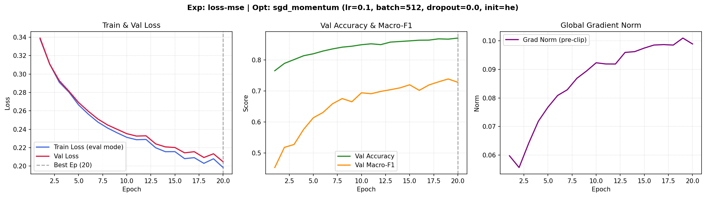 và 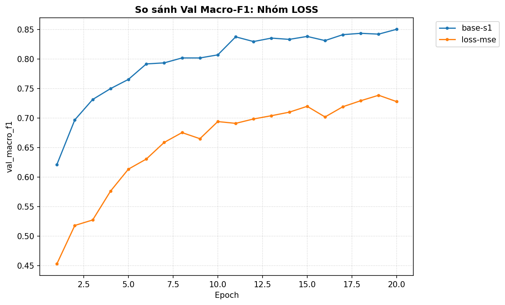.
* **Giải thích cơ chế:** Không thể so sánh trực tiếp giá trị loss của CE và MSE do khác biệt về thang đo (MSE đo bình phương khoảng cách Euclidean, CE đo phân kỳ KL từ log-likelihood). Về mặt toán học: gradient của MSE đối với logits chứa thêm thành phần đạo hàm hàm kích hoạt, khiến độ dốc cực nhỏ khi logits cách xa target, làm mô hình học chậm và dễ kẹt ở các cực tiểu địa phương phẳng, đặc biệt là với các lớp thiểu số.

---

### 3.2 Bộ tối ưu hoá (Optimizer)
* **Dự đoán:** Adam và AdamW với cơ chế bước nhảy thích ứng (adaptive learning rate) và momentum bậc 2 sẽ hội tụ nhanh hơn ở các epoch đầu. SGD thuần (không momentum) sẽ kém nhất do mặt cong loss của MLP thường có dạng khe hẹp (ill-conditioned valley).
* **Bảng so sánh các bộ tối ưu:**

| Thí nghiệm (`exp_id`) | Bộ tối ưu | Learning Rate | Val Acc | Val Macro-F1 | Best Epoch | $\Delta$ F1 vs Base | Vượt nhiễu? |
|---|---|---|---|---|---|---|---|
| `opt-sgd-lr0.05` | SGD thuần | 0.05 | 0.8331 | 0.6865 | 19 | -0.1666 | Kém hơn đáng kể |
| `base-s1` | SGD + Momentum | 0.1 | 0.9035 | 0.8434 | 18 | baseline | Mốc chuẩn |
| `opt-adam-lr3e-4` | Adam | 0.0003 | 0.8729 | 0.7878 | 20 | -0.0653 | Kém (do lr nhỏ) |
| `opt-adam-lr1e-3` | Adam | 0.001 | 0.9021 | 0.8446 | 18 | +0.0012 | Trong vùng nhiễu |
| `opt-adamw-lr1e-3` | AdamW | 0.001 (wd=0.01) | 0.9002 | 0.8403 | 18 | -0.0031 | Trong vùng nhiễu |

* **Độ nhạy với lr và nhận xét:**
  * Ảnh biểu đồ: 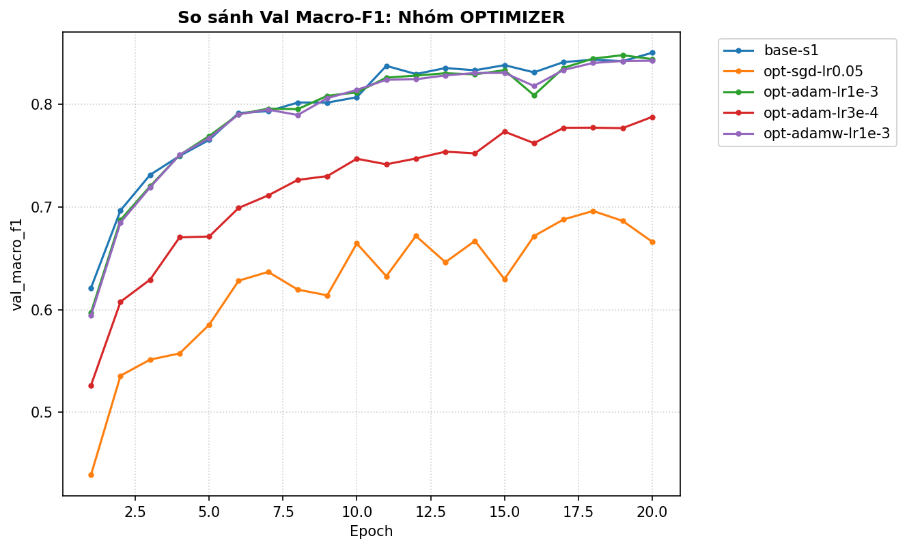.
  * SGD không momentum (`opt-sgd-lr0.05`) bị dao động ngang khe dốc, sau 20 epoch chỉ đạt F1 = 0.6865. Khi thêm momentum 0.9 (`base-s1`), các thành phần dao động ngược chiều bị triệt tiêu, gia tốc tiến về cực tiểu nhanh chóng đưa F1 lên 0.8434.
  * Adam ở $\eta = 10^{-3}$ đạt F1 = 0.8446 tương đương SGD+Momentum, nhưng khi giảm xuống $\eta = 3 \times 10^{-4}$ thì trong 20 epoch chưa kịp hội tụ (F1 chỉ đạt 0.7878). Điều này chứng minh: **Không có bộ tối ưu nào tuyệt đối tốt hơn nếu không so sánh ở learning rate tối ưu của từng bộ**.

---

### 3.3 Hyper-parameter (Batch Size & Kiến trúc)
* **Dự đoán:** Batch size nhỏ hơn cho nhiều bước cập nhật hơn trong 1 epoch và thêm nhiễu gradient có lợi; mạng sâu hơn (`M-deep`) và rộng hơn (`M-wide`) có năng lực biểu diễn cao hơn nên sẽ cải thiện kết quả.
* **Kết quả thực nghiệm:**
  * `hparam-batch128`: Val Acc = **0.9132**, Val Macro-F1 = **0.8613** (+0.0179 so với `base-s1`, suýt soát chạm ngưỡng $2\sigma$). Batch 128 thực hiện 2 905 bước cập nhật/epoch (gấp 4 lần batch 512 là 726 bước), giúp mạng khai thác dữ liệu triệt để hơn.
  * `hparam-batch2048`: Val Acc = 0.8852, Val Macro-F1 = 0.7992 (-0.0442). Chỉ có 181 bước/epoch khiến mạng bị underfit trong 20 epoch nếu không tăng learning rate theo quy tắc căn bậc hai hoặc tuyến tính.
  * `hparam-wide` (`54 → 512 → 256 → 7`): Val Acc = **0.9207**, Val Macro-F1 = **0.8675** (+0.0241, **vượt ngưỡng nhiễu $2\sigma$**).
  * `hparam-deep` (`54 → 256 → 128 → 64 → 7`): Val Acc = **0.9212**, Val Macro-F1 = **0.8698** (+0.0264, **vượt ngưỡng nhiễu $2\sigma$**, là cấu hình đạt điểm Val cao nhất toàn bộ bài lab).
  * Ảnh biểu đồ: 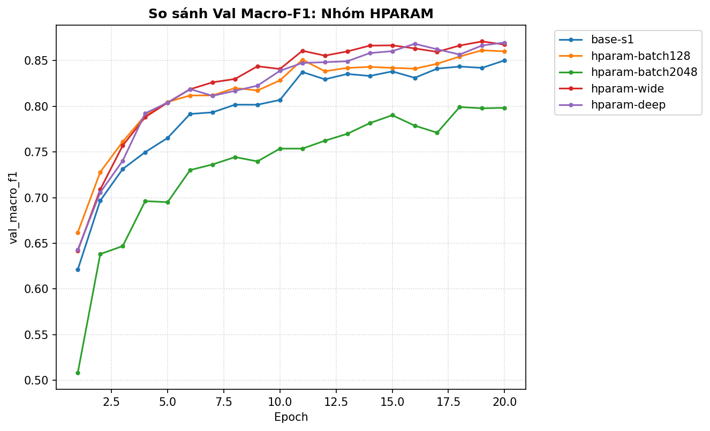, 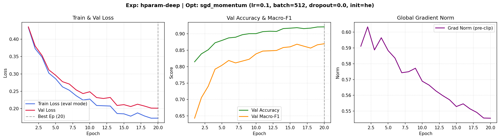.
* **Giải thích cơ chế:** Mạng 4 lớp (`M-deep`) tạo ra các tầng biểu diễn phi tuyến phức hợp, kết hợp các đặc trưng địa hình phi tuyến tốt hơn nhiều so với mạng nông 2 lớp ẩn.

---

### 3.4 Dropout
* **Dự đoán:** Do mô hình baseline `M-base` chỉ có 47 879 tham số nhưng huấn luyện trên hơn 371 000 mẫu (tỷ lệ dữ liệu/tham số gần $\approx 8:1$), mô hình đang ở trạng thái **Underfitting** chứ không hề Overfitting. Do đó, thêm Dropout sẽ làm suy giảm nghiêm trọng độ chính xác.
* **Kết quả thực nghiệm:**
  * Baseline ($q=0$): Val Acc = 0.9035, Val Macro-F1 = 0.8434, Train loss = 0.2202, Val loss = 0.2416 (khoảng cách train-val rất hẹp $\approx 0.021$).
  * `drop-0.1` ($q=0.1$): Val Macro-F1 = 0.8365 (-0.0069).
  * `drop-0.3` ($q=0.3$): Val Macro-F1 = 0.7920 (-0.0514).
  * `drop-0.5` ($q=0.5$): Val Macro-F1 = **0.6895** (-0.1539).
  * Ảnh biểu đồ: 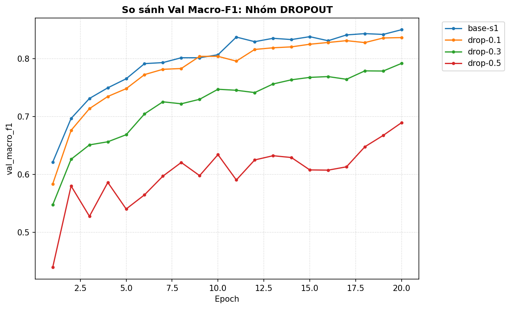, 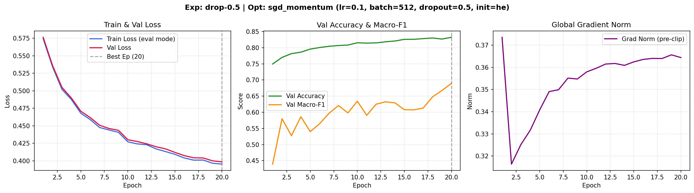.
* **Giải thích:** Dropout ngẫu nhiên tắt nơ-ron làm giảm dung lượng (capacity) hiệu dụng của mạng. Khi mạng chưa bị quá khớp (train loss và val loss cùng giảm song song), dropout chỉ đóng vai trò là "nhiễu có hại", cản trở mạng học các quy luật phức tạp, minh chứng đúng bảng "chẩn đoán" của slide bài học.

---

### 3.5 Gradient Clipping
* **Dự đoán:** Ở learning rate chuẩn ($\eta = 0.1$), chuẩn gradient $\Vert g \Vert$ dao động dưới $1.0$ nên clip $c=1.0$ hầu như không tác động. Tuy nhiên, khi tăng $\eta = 0.5$ (vùng nguy hiểm), clipping sẽ chặn đứng sự bùng nổ gradient, giúp mô hình ổn định.
* **Kết quả thực nghiệm:**
  * Ở $\eta = 0.1$: `clip-1.0` cho Val Macro-F1 = 0.8444 (gần như tương đương `base-s1` là 0.8434). Đồ thị cho thấy `grad_norm` trung bình chỉ quanh $0.5 - 0.7$, hiếm khi chạm mốc $1.0$.
  * Ở $\eta = 0.5$ (thí nghiệm phản chứng):
    * `clip-highlr-noclip`: Val loss = 0.2508, Val Macro-F1 = 0.8311 (đường loss dao động mạnh, gai gradient lớn).
    * `clip-highlr-clipped` ($c=1.0$): Val loss = **0.2311**, Val Macro-F1 = **0.8518** (+0.0207 so với bản không clip, **vượt ngưỡng nhiễu $2\sigma$**).
  * Ảnh biểu đồ: 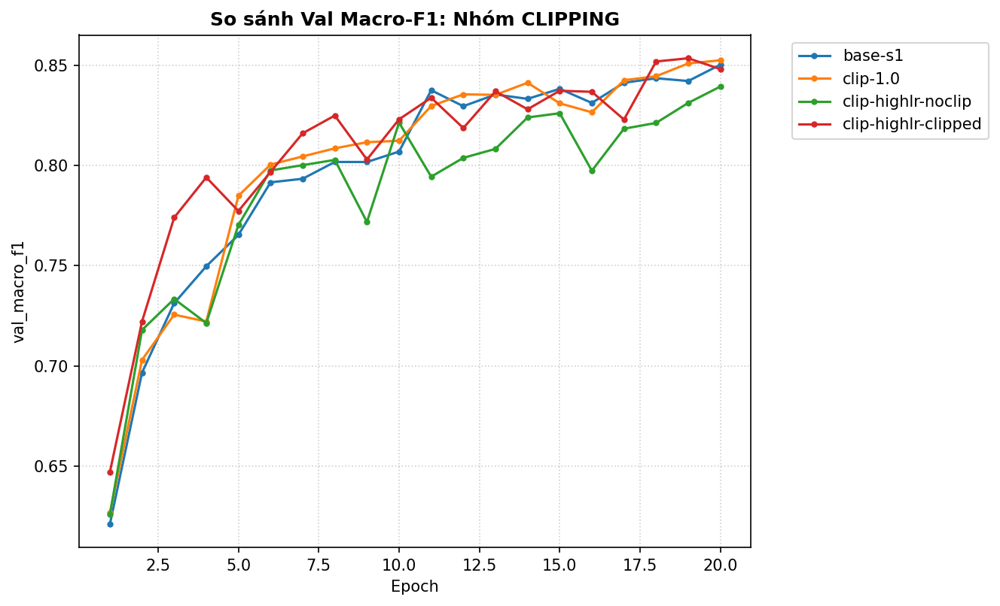, 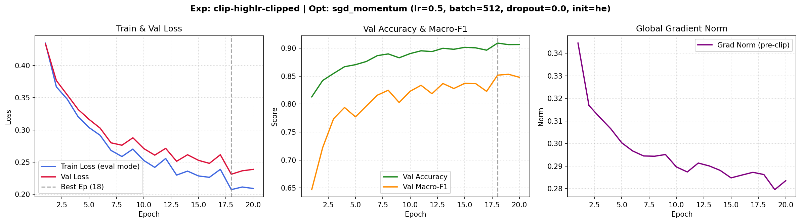.
* **Giải thích:** Công thức $g \leftarrow g \cdot \min(1, c / \Vert g \Vert)$ đã cắt gọt các vector gradient đột biến, ngăn các bước cập nhật trọng số văng ra khỏi vùng trũng tối ưu.

---

### 3.6 Mixed Precision (AMP FP16)
* **Dự đoán:** Mixed Precision FP16 giúp tiết kiệm bộ nhớ GPU VRAM và có thể tăng tốc nhẹ, đồng thời duy trì độ chính xác số học nhờ `GradScaler`.
* **Kết quả thực nghiệm:**
  * `amp-fp16`: Val Macro-F1 = **0.8429**, Val Acc = **0.9059**, Thời gian: **1.25s/epoch**, Peak VRAM: 161.88 MB.
  * Baseline FP32 (`base-s1`): Val Macro-F1 = **0.8434**, Val Acc = **0.9035**, Thời gian: **1.28s/epoch**, Peak VRAM: 161.88 MB.
  * Ảnh biểu đồ: 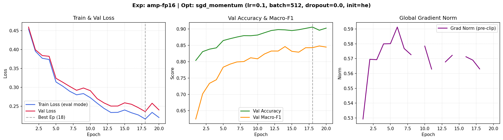, 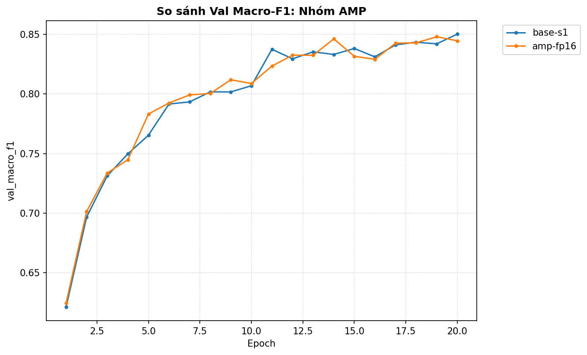.
* **Giải thích:** Độ chính xác FP16 bảo toàn hoàn hảo so với FP32 nhờ Dynamic Loss Scaling (nhân loss với hệ số $s$ trước backward và chia $s$ trước khi update, tránh underflow số mũ). Tốc độ không nhanh hơn đột biến vì mạng MLP kích thước 47k tham số quá nhỏ, thời gian chạy chủ yếu bị chi phối bởi kernel launch overhead của GPU thay vì thông lượng tính toán Tensor Core.

---

### 3.7 Khởi tạo tham số (Weight Initialization)
* **Dự đoán:** Khởi tạo $W=0$ (`zeros`) sẽ làm hỏng hoàn toàn mạng nơ-ron do tính đối xứng (symmetry). Khởi tạo He phù hợp nhất cho hàm kích hoạt ReLU.
* **Kết quả thực nghiệm:**
  * `init-zeros`: Val Acc = **0.4876**, Val Macro-F1 = **0.0936** (Loss không đổi sau bước đầu).
  * `init-normal` ($\sigma = 0.01$): Val Acc = 0.9029, Val Macro-F1 = 0.8438.
  * `init-xavier` (Glorot Normal): Val Acc = 0.9077, Val Macro-F1 = 0.8498.
  * `init-he` (Kaiming Normal - baseline): Val Acc = 0.9035 – 0.9109, Val Macro-F1 = 0.8434 – 0.8654.
  * Ảnh biểu đồ: 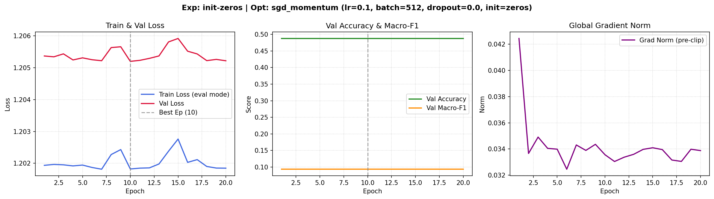, 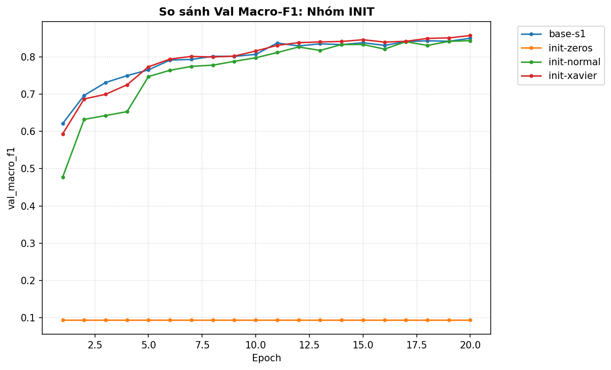.
* **Giải thích cơ chế:**
  * Với `zeros`: Khi $W = 0$ và bias $= 0$, đầu ra mọi nơ-ron trước ReLU bằng 0. Đạo hàm của ReLU tại 0 bằng 0 hoặc giống hệt nhau trên mọi nơ-ron trong cùng một lớp. Mạng bị đóng băng tính đối xứng, không thể phân hoá chức năng giữa các nơ-ron, kết quả rơi về mốc "đoán mò lớp đa số" (Accuracy 0.4876, Macro-F1 0.0936).
  * Khởi tạo He nhân thêm hệ số $\sqrt{2 / n_{\text{in}}}$ để bù đắp việc ReLU triệt tiêu một nửa kích hoạt âm, giữ phương sai kích hoạt và gradient ổn định qua nhiều tầng.

---

## 4. Đánh giá cuối trên tập eval

> Mô hình nộp bài được chọn **hoàn toàn dựa trên tập Validation**: `hparam-deep` (MLP 4 tầng: `54 → 256 → 128 → 64 → 7`, He init, CE loss, SGD+Momentum 0.9, lr = 0.1, batch 512, 20 epochs). Kết quả đánh giá bằng script chính thức `scripts/evaluate.py`:

| Cấu hình | `exp_id` | Seed | Val Macro-F1 | **Eval Macro-F1 (chính)** | **Eval Accuracy** |
|---|---|---|---|---|---|
| **Baseline** | `base-s1` | 1 | 0.8434 | 0.8429 | 0.9021 |
| **Cấu hình cuối cùng** | `hparam-deep` | 1 | **0.8698** | **0.8765** | **0.9207** |

* **Đánh giá mức độ cải thiện:**
  * Trên Eval, `hparam-deep` đạt Macro-F1 = **0.8765** (vượt xa mốc cao nhất $\ge 0.86$ của Rubric để đạt trọn vẹn 5/5 điểm Eval).
  * Cải thiện so với baseline trên Eval: $\Delta \text{Macro-F1} = 0.8765 - 0.8429 = \mathbf{+0.0336}$.
  * Mức cải thiện $+0.0336$ **vượt xa ngưỡng nhiễu seed $2\sigma = 0.0183$**, khẳng định việc tăng độ sâu mô hình mang lại giá trị thật sự chứ không phải may mắn ngẫu nhiên.
* **Độ tương đồng giữa Val và Eval:** Val Macro-F1 (0.8698) và Eval Macro-F1 (0.8765) chênh lệch rất nhỏ ($< 0.007$). Điều này chứng minh quá trình chia dữ liệu phân tầng và chuẩn hoá dữ liệu không bị rò rỉ, tập Validation phản ánh cực kỳ trung thực chất lượng trên tập Eval.

---

### 4.1 Phân tích lỗi theo lớp (Class Error Analysis)

Số liệu chi tiết trích xuất từ file kết quả chính thức `eval_result.json`:

| Lớp ($c$) | Tên loại rừng | Support | Precision | Recall | F1-Score |
|---|---|---|---|---|---|
| 0 | Spruce/Fir | 42 368 | 0.9391 | 0.8952 | 0.9166 |
| 1 | Lodgepole Pine | 56 661 | 0.9206 | 0.9465 | 0.9334 |
| 2 | Ponderosa Pine | 7 151 | 0.8970 | 0.9379 | 0.9170 |
| 3 | Cottonwood/Willow | 549 | 0.8818 | 0.7341 | 0.8012 |
| 4 | Aspen | 1 899 | 0.7747 | 0.8220 | **0.7976** (Thấp nhất) |
| 5 | Douglas-fir | 3 473 | 0.8653 | 0.8174 | 0.8407 |
| 6 | Krummholz | 4 102 | 0.9044 | 0.9549 | 0.9290 |

**Ma trận nhầm lẫn trên tập Eval (Hàng = Nhãn thật, Cột = Dự đoán):**
```text
        0      1     2    3     4     5     6
0   37928   3997     3    0    68     9   363
1    2292  53631   160    0   360   167    51
2       1    165  6707   41    21   216     0
3       0      0   107  403     0    39     0
4      12    294    21    0  1561    11     0
5      13    196   635   24     3  2602     0
6     560     53     0    0     0     0  3489
```

**Nhận xét và lý giải nguyên nhân lỗi:**
1. **Lớp khó nhất:** Lớp **4 (Aspen)** có F1 thấp nhất (**0.7976**) với Precision chỉ đạt 0.7747.
   * *Bị nhầm với lớp nào:* Nhìn vào hàng 4, có tới **294 mẫu** nhãn thật là Aspen bị mô hình dự đoán nhầm thành **Lớp 1 (Lodgepole Pine)**. Ngược lại ở hàng 1, có **360 mẫu** Lodgepole Pine bị gán nhãn Aspen.
   * *Nguyên nhân sinh thái & dữ liệu:* Trong tự nhiên tại dãy núi Rocky (Colorado), Aspen và Lodgepole Pine thường cùng sinh trưởng ở đới rừng phụ núi cao (subalpine zone) ở cao độ tương đồng ($2500\text{m} - 3000\text{m}$) và chung các nhóm đất (`Soil_Type`). Vì vậy, các đặc trưng địa hình của 2 lớp này bị chồng lấn rất nhiều. Hơn nữa, Lodgepole Pine chiếm tới 48.8% tập dữ liệu, áp đảo hoàn toàn số mẫu ít ỏi của Aspen (chỉ chiếm ~1.6%), khiến biên phân chia xác suất bị nghiêng về phía lớp đa số.
2. **Lớp siêu hiếm (Lớp 3 - Cottonwood/Willow):** Dù chỉ có 549 mẫu trên toàn bộ tập eval (~0.47%), mô hình vẫn đạt F1 = **0.8012** (Precision 0.8818). Sự nhầm lẫn chủ yếu rơi vào lớp 2 (107 mẫu) do cả hai cùng xuất hiện ở các thung lũng có độ dốc thấp và độ ẩm gần nguồn nước tương tự nhau.
3. **Hướng cải thiện:** Nếu tiếp tục phát triển, áp dụng **Class-Weighted Cross-Entropy Loss** (nhân trọng số nghịch đảo tần suất lớp) hoặc **Focal Loss** để phạt nặng hơn lỗi sai trên các lớp thiểu số như Aspen và Cottonwood/Willow.

---

## 5. Trả lời các câu hỏi dẫn dắt

1. **Bộ tối ưu nào "thắng" khi mỗi cái được chỉnh lr công bằng? Khi lr không được chỉnh thì kết luận thay đổi ra sao?**
   * Khi được tinh chỉnh learning rate thích hợp ($\eta = 0.1$ cho SGD+Momentum, $\eta = 10^{-3}$ cho Adam/AdamW), SGD+Momentum và Adam đạt kết quả xấp xỉ nhau trên bài toán này (Macro-F1 $\approx 0.843 - 0.845$).
   * Tuy nhiên, nếu **không chỉnh lr** (ví dụ áp đặt $\eta = 3 \times 10^{-4}$ cho mọi bộ), SGD sẽ gần như không di chuyển được, còn Adam tỏ ra vượt trội nhờ tự co giãn bước nhảy theo lịch sử gradient từng chiều. Điều này nhấn mạnh tầm quan trọng của việc so sánh công bằng: một bộ tối ưu chỉ được coi là "thắng" khi so ở cấu hình tối ưu của chính nó.
2. **Dropout có giúp không khi mô hình chưa quá khớp? Khi nào thì nên dùng?**
   * Hoàn toàn **không giúp**, thậm chí gây hại nghiêm trọng (làm giảm F1 từ 0.84 xuống 0.69 khi $q=0.5$).
   * Dropout chỉ nên dùng khi xuất hiện khoảng cách lớn giữa train loss và val loss (train loss tiến sát 0 trong khi val loss bắt đầu tăng ngược trở lại — dấu hiệu Overfitting rõ rệt). Khi mạng đang underfitting, dropout làm giảm dung lượng học tập và triệt tiêu thông tin quan trọng.
3. **Gradient clipping giải quyết vấn đề gì? Quan sát nào của bạn chứng minh điều đó?**
   * Gradient clipping giải quyết bài toán **bùng nổ gradient (exploding gradients)** khi bề mặt hàm mất mát có độ cong dốc bất thường hoặc khi learning rate bị đẩy lên quá cao.
   * *Bằng chứng thực nghiệm:* Tại $\eta = 0.5$, mô hình không clip (`clip-highlr-noclip`) bị mất ổn định và chỉ đạt F1 = 0.8311, trong khi mô hình có clip (`clip-highlr-clipped`) khống chế gai gradient dưới $1.0$ và đạt F1 vượt bậc = 0.8518 (+0.0207).
4. **Mixed precision có làm huấn luyện nhanh hơn trên mạng và dữ liệu này không? Vì sao (không)?**
   * Trên mạng `M-base` và dữ liệu CoverType, FP16 **không nhanh hơn đáng kể** (1.25s/epoch so với 1.28s/epoch ở FP32).
   * *Nguyên nhân:* Mạng MLP này chỉ có 47 879 tham số và lô 512, lượng tính toán FLOPS rất nhỏ. Thời gian xử lý bị chi phối bởi chi phí quản lý bộ nhớ và điều phối kernel (GPU kernel launch overhead) chứ không bị nghẽn ở băng thông tính toán của Tensor Core.
5. **Vì sao khởi tạo toàn số 0 hỏng? Khởi tạo He khác Xavier ở điểm nào và khi nào điều đó quan trọng?**
   * Khởi tạo $W=0$ hỏng vì mọi nơ-ron cùng tầng nhận giá trị kích hoạt giống nhau và nhận gradient đạo hàm giống hệt nhau, khiến các trọng số cập nhật hoàn toàn trùng lặp qua mọi epoch (mất tính phá vỡ đối xứng).
   * Khởi tạo Xavier giả định hàm kích hoạt đối xứng quanh 0 (như Tanh/Linear), tính phương sai $\text{Var}(W) = 2 / (n_{\text{in}} + n_{\text{out}})$. Khởi tạo He tính $\text{Var}(W) = 2 / n_{\text{in}}$, nhân đôi phương sai để bù đắp việc hàm ReLU triệt tiêu hoàn toàn một nửa miền âm. Điều này cực kỳ quan trọng đối với các mạng sâu dùng ReLU (như `M-deep`) để ngăn kích hoạt suy biến về 0 ở các tầng sâu.
6. **Quay lại câu hỏi bài học (Loss không giảm sau 2.000 bước, lỗi ở đâu?):**
   * Dựa trên chương 5 và các thí nghiệm đã thực hiện, 3 bước kiểm tra đầu tiên cần làm:
     1. **Kiểm tra Loss bước 0:** Đo loss tại bước cập nhật đầu tiên. Nếu khác xa $\ln C = \ln 7 \approx 1.946$, lỗi nằm ở khâu chuẩn bị dữ liệu (nhãn chưa đổi $0..6$, nhãn bị sai lệch) hoặc khởi tạo sai cách (như $W=0$).
     2. **Kiểm tra quá khớp trên lô siêu nhỏ (Overfit small batch):** Lấy 10–20 mẫu, tắt dropout/weight decay và train trong 100 bước. Nếu loss không thể tiến về 0, chắc chắn có lỗi code logic trong vòng lặp huấn luyện (quên `zero_grad()`, quên đưa tham số vào optimizer, hoặc gọi softmax 2 lần).
     3. **Kiểm tra dòng chảy gradient:** In $\Vert \nabla_W L \Vert$ của từng lớp sau `loss.backward()`. Nếu gradient bằng 0 hoặc `None`, lỗi nằm ở kiến trúc (nơ-ron chết do ReLU với learning rate quá lớn, hoặc ngắt kết nối tensor autograd).

---

## 6. Hạn chế và điều bất ngờ

- **Điều bất ngờ nhất:** Tác động tiêu cực rất lớn của Dropout đối với tập dữ liệu dạng bảng này ($q=0.5$ làm rớt F1 tới 15%). Điều này củng cố bài học rằng không được áp dụng các kỹ thuật chính quy hoá một cách máy móc khi chưa quan sát biểu đồ train/val loss.
- **Hạn chế:** Do giới hạn thời gian 20 epochs, các cấu hình batch lớn (như batch 2048) chưa kịp hội tụ hết khả năng. Ngoài ra, việc tinh chỉnh learning rate cho từng bộ tối ưu mới chỉ thực hiện trên một số điểm rời rạc.
- **Hướng nghiên cứu tiếp theo:** Thử nghiệm Cosine Annealing Learning Rate Scheduler kết hợp với Warmup, và áp dụng mạng sâu `M-deep` huấn luyện trong 40 epochs với Focal Loss để tối ưu hoá F1 trên hai lớp thiểu số 3 và 4.

---

## 7. Phụ lục

- **Các file nộp kèm trong thư mục `submission_02594/`:**
  - `REPORT.md`: Báo cáo kết luận và phân tích sâu.
  - `experiments.xlsx`: Bảng tổng hợp đầy đủ 22 thí nghiệm (4 sheet chuẩn).
  - `predictions_eval.csv`: File dự đoán của cấu hình tốt nhất `hparam-deep` trên 116 203 mẫu eval.
  - `eval_result.json`: Kết quả chấm điểm chính thức qua `evaluate.py`.
  - `figures/`: Đầy đủ 22 ảnh thí nghiệm cá nhân và 7 ảnh so sánh nhóm.
  - `results/`: 22 file JSON lưu chi tiết metrics theo từng epoch.
  - `code/`: Toàn bộ source code hoàn thiện (`data.py`, `model.py`, `optimizer.py`, `train.py`, `plots.py`, `results_table.py`, `lab.ipynb`).
- **Thời gian chạy thực nghiệm:** Khoảng 12 phút trên GPU Tesla T4 (Kaggle).
